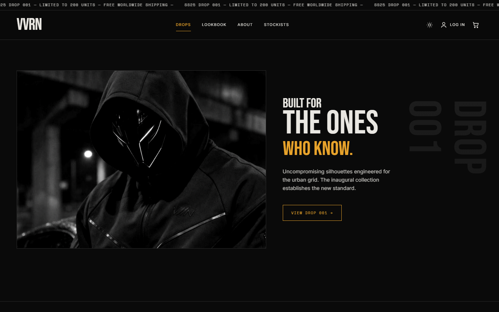
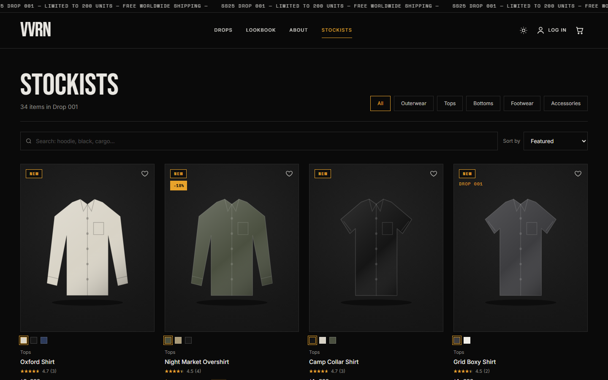
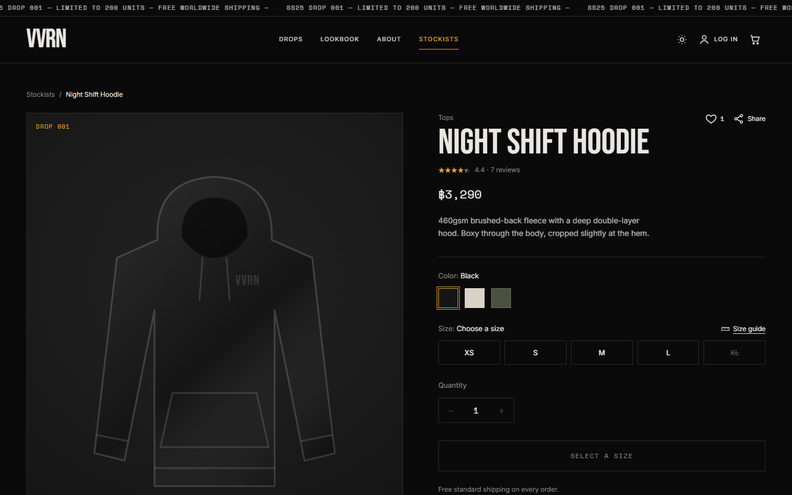
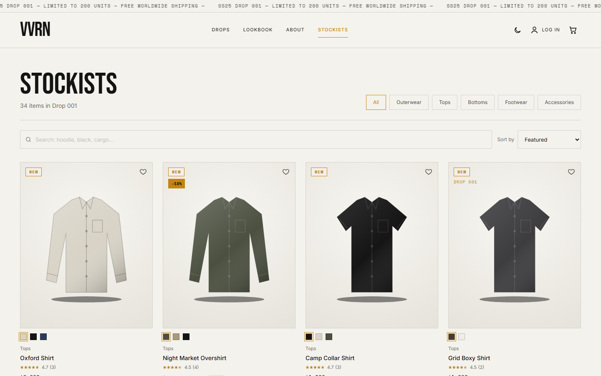
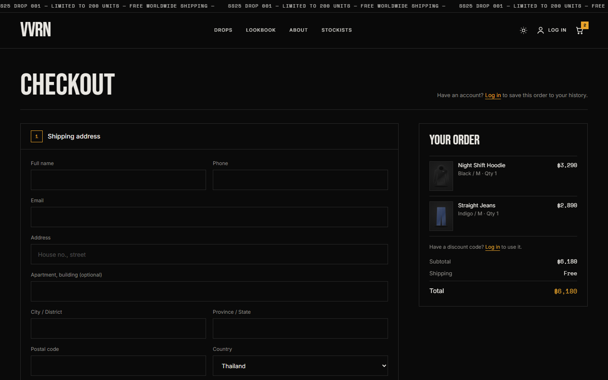

# VVRN — Drop 001

A full-stack streetwear store built as a portfolio project: storefront, checkout, customer accounts, an admin back office, transactional email and a SQL Server database.

> ภาษาไทย: [README.th.md](README.th.md) (step-by-step setup guide)



| Shop | Product |
|---|---|
|  |  |
| **Day mode** | **Checkout** |
|  |  |

> No real product photography yet: garments are drawn as SVG and recolored per color. Admins can upload real photos per product and color.

## Stack

| | |
|---|---|
| **Frontend** | React 18, TypeScript, Vite 6, Tailwind CSS 3 (no UI library) |
| **Backend** | Node.js, Express 4, TypeScript, zod, bcrypt, JWT in an httpOnly cookie, multer |
| **Database** | Microsoft SQL Server (T-SQL scripts, `mssql` driver, no ORM) |
| **Email** | [Resend](https://resend.com) HTTP API through a database outbox |

## Features

**Shop**
- 34 products in 5 categories, color/size variants with live stock, sale prices, NEW (first 3 days) and Limited badges
- Search, category filter and sort (featured, newest, price); sold out always last
- Product pages with photo gallery, size guides (cm/inch), reviews from verified buyers, likes, share links
- "Complete the look" recommendations from matching categories
- "Notify me" on sold-out sizes: one email when the size is restocked
- Day/Night theme, scrolling promo bar, animated hero video with 3D tilt and parallax

**Checkout & accounts**
- Guest or logged-in checkout, saved address, card (test mode: only brand + last 4 digits reach the server) or QR transfer with slip upload
- Discount codes (percent off, one per account, enforced by a unique index)
- Order history, tracking timeline, password reset with a 6-digit code

**Admin back office** (`#/admin`, role-based: customer / staff / admin)
- Orders: slip review, forward-only status flow (paid → packed → shipped → delivered), cancel with automatic restock, email log with retry
- Products: create products, edit details, prices and stock (with conflict detection), add colors/sizes, upload photos, show/hide
- Discount codes, promo bar text, user roles

## How it's built (the interesting parts)

- **Prices and totals are always computed on the server** from the database, never trusted from the browser.
- **No overselling:** stock is taken with `UPDATE ... SET Stock = Stock - @qty WHERE Stock >= @qty` inside the same transaction as the order; if any line fails the whole order rolls back.
- **Email outbox:** every email row is written in the same transaction as the change it's about, sent right after commit, and retried with backoff by a background worker. Rows are claimed with `READPAST`/`UPDLOCK` leases so two workers never send the same email, and Resend gets an idempotency key.
- **Roles are checked on the backend on every request** (re-read from the database, so demoting someone works immediately). The role in the JWT is only a UI hint.
- **Uploads are checked by their bytes**, not their file name: product photos must really be JPG/PNG/WebP; payment slips are never served publicly.
- **Migrations are additive and re-runnable**, and the code keeps working before a new migration has been run.

## Run it locally

You need **Node.js 20+**, **SQL Server** (Express or Developer edition) and **SSMS**. The Thai guide ([README.th.md](README.th.md)) covers every step, including SQL Server login and TCP/IP settings and common errors.

1. **Database** — in SSMS, run in order:
   `database/00_create_database.sql` (set your own password first), `01_schema.sql`, `02_seed.sql`, `10_more_products.sql`, `11_sample_reviews.sql`.
   (`03`–`09` are upgrade scripts for an older database; a fresh install doesn't need them.)
2. **Backend**
   ```bash
   cd backend
   npm install
   cp .env.example .env   # then set DB_PASSWORD and JWT_SECRET
   npm run dev            # http://localhost:4000/api/health
   ```
   Without `RESEND_API_KEY`, emails are saved as HTML files in `backend/mail-outbox/` instead of being sent.
3. **Frontend**
   ```bash
   cd frontend
   npm install
   npm run dev            # http://localhost:5173
   ```
4. **Make yourself admin:** register on the site, then in SSMS
   `UPDATE dbo.Users SET Role = 'admin' WHERE Email = N'you@example.com';`

Test cards (no real charge): `4242 4242 4242 4242` (Visa), `3782 8224 6310 005` (Amex, 4-digit code). Discount code: `VVRN10`.

## Project layout

```
database/   T-SQL: schema, seed data, re-runnable migrations
backend/    Express API (port 4000, routes under /api)
frontend/   React app (port 5173, proxies /api to the backend)
docs/       README screenshots
```

## Notes

- This is a portfolio project, not a live shop. Card payments are a test mode and the sample reviews (`UserId IS NULL`) are written for the demo; they're never labeled "Verified buyer".
- The hero video was generated with an AI video tool from the hero photo.
